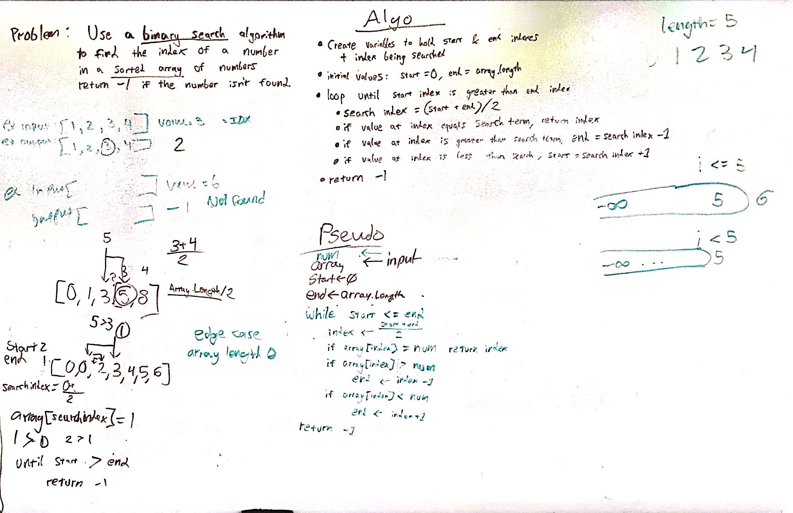

# Binary Search

------------------------------

# Binary Search
#### Challenge 03 Binary Search
##### *Author: Mike Kelly*

------------------------------

## Description
This is a C# code challenge for a binary search.
------------------------------

## Getting Started
Clone this repository to your local machine.
```
$ git clone [https://github.com/Michael-S-Kelly/data-structures-and-algorithms.git]
```
#### To run the program from Visual Studio:
Select ```File``` -> ```Open``` -> ```Project/Solution```

Next navigate to the location you cloned the Repository.

Double click on the ```BChallenges\BinarySearch``` directory.

Then select and open ```BinarySearch.sln```

------------------------------

## Visuals
***[Add screenshots of your application in action]***

##### Whiteboard



------------------------------

## Change Log
***[The change log will list any changes made to the code base. This includes any changes from TA/Instructor feedback]***


------------------------------
## Collaborators, Contributors, and Other Resources used

### Collaborators
Benjamin Taylor

Tanner Percival


### Contributors
Phil Werner

### Other Resources


------------------------------
For more information on Markdown: https://www.markdownguide.org/cheat-sheet