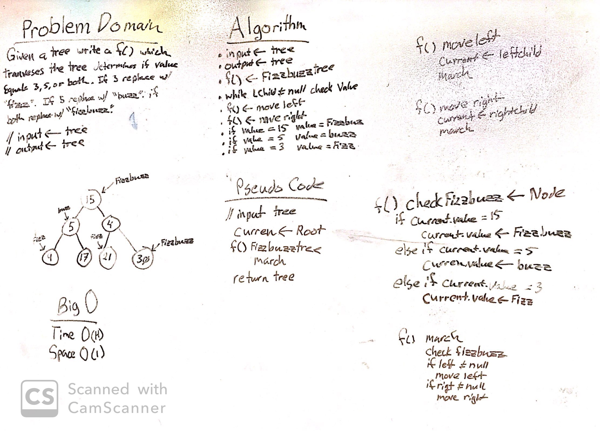

# Code: Implement a Link Lis***
------------------------------

# Lab 05: Linked Lists
#### *Author: Mike Kelly*

------------------------------

## Description

This C# implementation runs through a tree; changes all numbers divisiable by 15 to "Fizzbuzz", 5 to "Buzz", and 3 to "Fizz".

------------------------------

## Methods

| Method | Summary | Big O Time | Big O Space | Example | 
| :----------- | :----------- | :-------------: | :-------------: | :----------- |
| FizzBuzzTre | This method changes all numbers divisiable by 15 to "Fizzbuzz", 5 to "Buzz", and 3 to "Fizz".  Then returns all numbers to a list | O(n) | O(n) | N/A |

------------------------------

## Visuals
#### Whiteboard

------------------------------

## Change Log

------------------------------

For more information on Markdown: https://www.markdownguide.org/cheat-sheet
