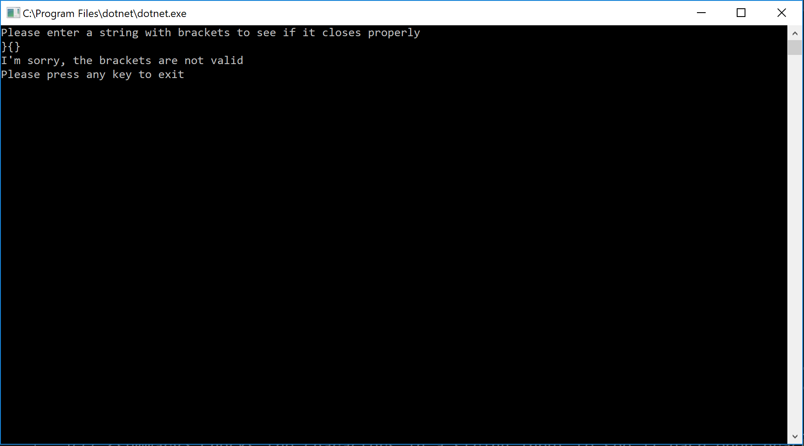

# ***Data Structure Implementation***
------------------------------

# Multi-Bracket Validation
#### *Author: Mike Kelly*

------------------------------

## Description

A C# implementation of a `Multi-Bracket Validation`. Given a string it checks to see if the brackets are opened and closed properly.

------------------------------

## Methods

| Method | Summary | Big O Time | Big O Space | Example | 
| :----------- | :----------- | :-------------: | :-------------: | :----------- |
| BracketValidation | Takes in a string and returns a boolean depending on if the brackets are properly opened and closed | O(n) | O(1) | "{[()]}" |

------------------------------

## Visuals

##### BracketValidation
*The BracketValidation Method takes in a string and turns it into an array of characters.*
*It then checks to see if the first character is an closed bracket, if it is, it returns false.* 
*Otherwise, it runs the rest of the characters in a loop to see if each bracket that opens, closes properly.*
*If it does return properly, it returns true.  If it doesn't, it returns false.*

------------------------------

## Change Log

------------------------------

For more information on Markdown: https://www.markdownguide.org/cheat-sheet