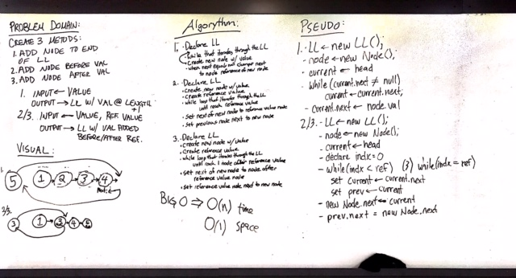
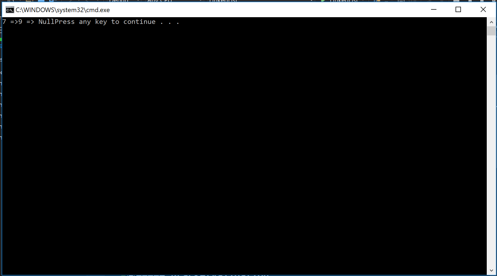

# Code: *** Implement a Linked List ***
------------------------------

# Lab 05: Linked Lists
#### *Author: Mike Kelly*

------------------------------

## Description

This C# implementation runs through the data-structures of Linked Lists.  This includes establishing a linked list, inserting a node at the head, inserting a node at the end, inserting a node before a specific node, inserting a node after a specific node, and merging 2 nodes.

------------------------------

## Methods

| Method | Summary | Big O Time | Big O Space | Example | 
| :----------- | :----------- | :-------------: | :-------------: | :----------- |
| instantiateList | This method creates a new Linked list with 2 nodes. | O(1) | O(1) | N/A |
| Node | This method creates a new node with inputted data| O(1) | O(1) | Data = 5 |
| SLinkedList | Required at the creation of a Linked List.  Adds a node assigned to Head.| O(1) | O(1) | Data = 5 |
| Print | This method prints out a list of integers that are in the Linked List| O(n) | O(1) | 5,4,3,2,1 |
| Includes | This method checks to see if a praticular integer is in the Linked list| O(n) | O(1) | 3 |
| Insert | This method inserts a node into the Linked List| O(1) | O(1) | 3 |
| Append | Appends a new node to the end of the Linked List | O(n) | O(1) | 3 |
| InsertBefore | Inserts a new node int thte list before a given node | O(n) | O(1) | 3 |
| InsertAfter | Inserts a new node into the list after a given node | O(n) | O(1) | 3 |
| ValueAtIndex | Given an index number, returns the value at the Node at that index number | O(n) | O(1) | 3 |

------------------------------

## Visuals

##### BracketValidation
* Instantiates a Linked List, creates a node, checks to see if a praticular node value is in the linked list, inserts a value in a new node at the head of the linked list, and prints a list of the values in the linked list.

------------------------------

## Change Log
1.1 Updated the ReadMe file
1.2 Fixed a few methods, added some more tests, updated ReadMe file

------------------------------

For more information on Markdown: https://www.markdownguide.org/cheat-sheet
