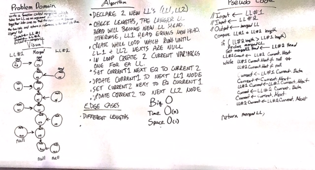

# Code: Implement a Link List

------------------------------

# Data-Structures
#### Lab 05 - 08: Linked Lists
##### *Author: Mike Kelly*

------------------------------

## Description
This C# program is runs through the data-structures of Linked Lists.  This includes establishing a linked list, inserting a node at the head, inserting a node at the end, inserting a node before a specific node, inserting a node after a specific node, and merging 2 nodes.

------------------------------

## Getting Started
Clone this repository to your local machine.
```
$ git clone [https://github.com/Michael-S-Kelly/data-structures-and-algorithms.git]
```
#### To run the program from Visual Studio:
Select ```File``` -> ```Open``` -> ```Project/Solution```

Next navigate to the location you cloned the Repository.

Double click on the ```DataStructures``` directory.

Double click on the ```LinkedList``` directory.


Then select and open ```LinkedList.sln```

------------------------------

## Visuals


##### Challenge 06 Whiteboard

##### Challenge 07 Whiteboard

##### Challenge 08 Whiteboard


------------------------------

## Change Log
1.1 Updated code to align with Amanda's Code


------------------------------
## Collaborators, Contributors, and Other Resources used

### Collaborators
#### Phil Werner

#### Jason Few

### Contributors


### Other Resources
#### Microsoft Visual C# Step by Step Ninth Edition
#### C# 7.0 in a Nutshell
#### C# Pocket Reference
#### C# and .NET Core Test-Driven Development
#### https://stackoverflow.com/questions/3823848/creating-a-very-simple-linked-list
#### https://docs.microsoft.com/en-us/previous-versions/visualstudio/visual-studio-2008/xwth0h0d(v=vs.90) 

------------------------------
For more information on Markdown: https://www.markdownguide.org/cheat-sheet