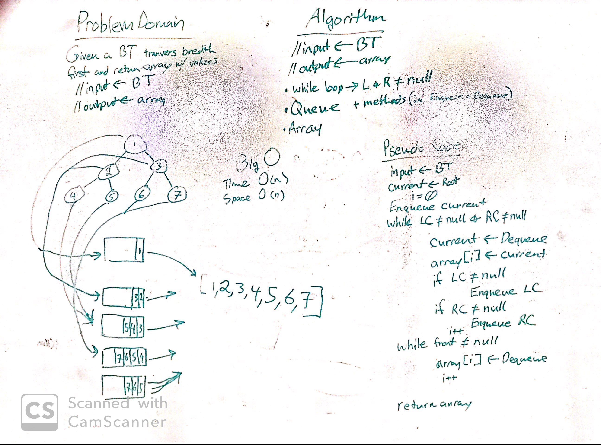
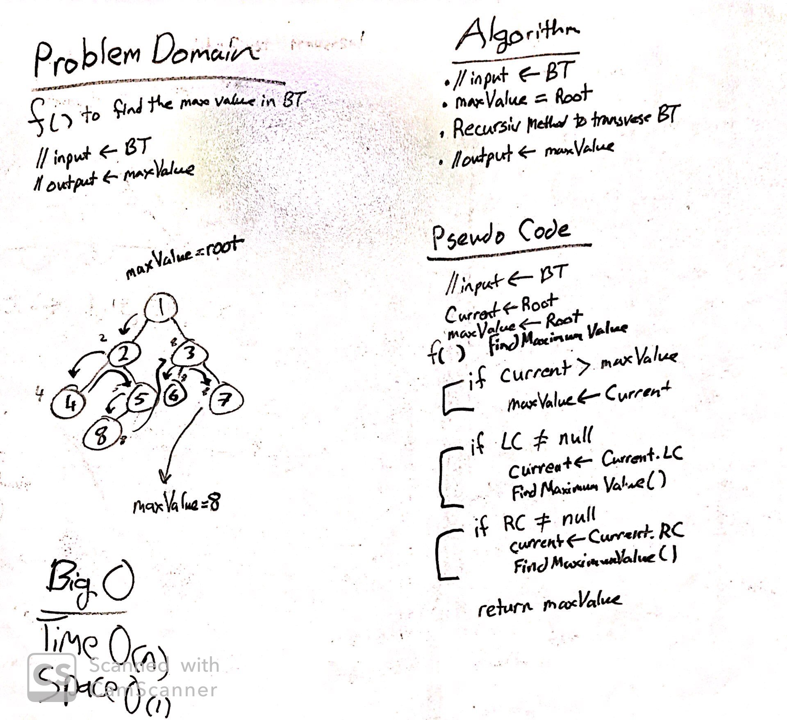

# Lab 15 & 17: Trees
------------------------------

# Transversal Patterns
#### *Author: Mike Kelly*

------------------------------

## Description

This C# implementation creates a binary search tree and uses each of the three methods (preOrder, inOrder, and postOrder) to search the tree.

------------------------------

## Methods

| Method | Summary | Big O Time | Big O Space | Example | 
| :----------- | :----------- | :-------------: | :-------------: | :----------- |
| BinaryTree | Creates a new Binary Search Tree with new Node Root instatiation. | O(1) | O(1) | N/A |
| Add | Adds a new node to an existing Binary Search Tree. | O(logN) | O(1) | 2 |
| Contains | Transverses through a Binary Search Tree to see if it contains a praticular value. | O(logN) | O(1) | 2 |
| BreadthFirst | Create an array that shows the value order of a breadth-first search of the binary tree. | O(n) | O(n) | {1, 4, 5 } |
| FindMaximumValue | Looks through the entire Binary Tree to find the Maximum Data Value. | O(n) | O(1) | 13 |

------------------------------

## Visuals
##### Whiteboard

##### Whiteboard

------------------------------

## Change Log

------------------------------

For more information on Markdown: https://www.markdownguide.org/cheat-sheet
